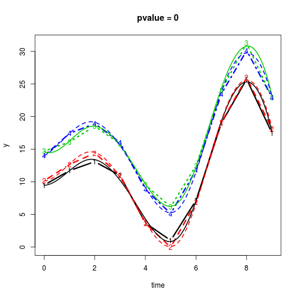

# TPDT
  
## Time resolved paired differences test
`TPDT` is an R package suited for the analysis of time-resolved observations. More specifically, we provide a collection of state of the art tools which all have the task of exploring the difference of two groups of functional observations over a specified time interval. Moreover, we provide an additional tool - the TPDT (Time-resolved Paired Differences Test) - which in some situations has a better performance in terms of AUC and power compared to the here implemented competitors (publication to appear soon). 

## Installation

1. Install `devtools` from CRAN with `install.packages("devtools")`.

2. Until this package is published on CRAN, you can install it from github 


with `devtools::install_github("toreerdmann/TPDT")`

After that you load it as usual with `library(TPDT)`

## Demo

```r
library(TPDT)

# Simulate paired data with underlying function f with
# a shift of 5 between the groups
f <- function(x) 2 * x * sin(x) + 10
simdata <- make_data(shift = 5, n = 2, sd1 = .5, sd2 = .5, 
                     ntimepoints = 10,type = "shift", f = f)
# run test
result <- TPDT(simdata, B = 200) 

# plot data and pvalue from the test
matplot(y = matrix(simdata$data, nrow = 10), 
        x = matrix(simdata$time, nrow = 10), 
        main = paste("pvalue =", result$p), 
        ylab = "y", xlab = "time", type = "b", lwd = 3)
plot(result$funcdata$func1, add = TRUE, lwd = 2)
plot(result$funcdata$func2, add = TRUE, lwd = 2, 
     col = c(3, 4))
```

 

